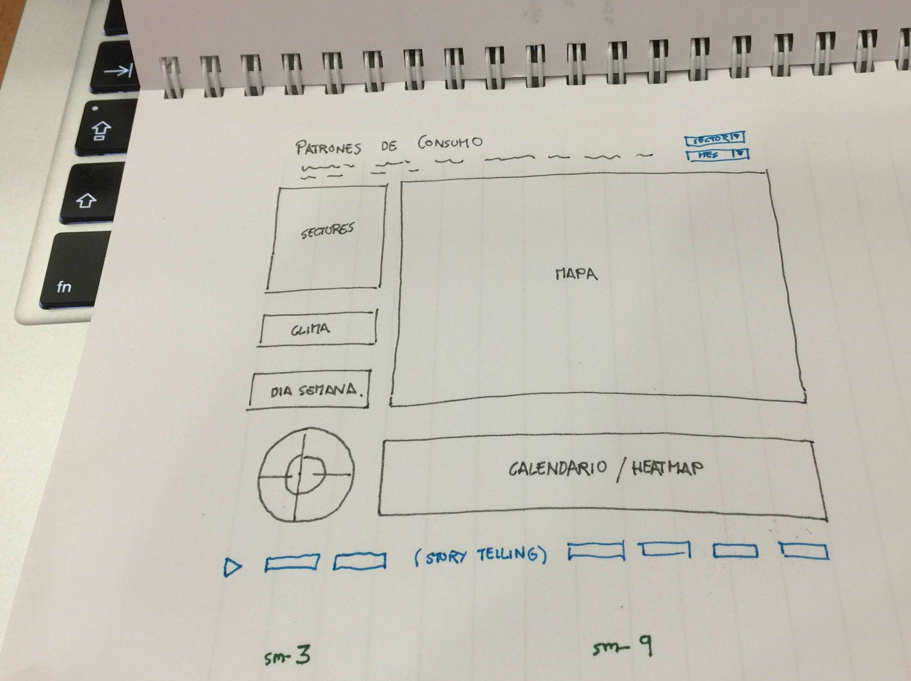
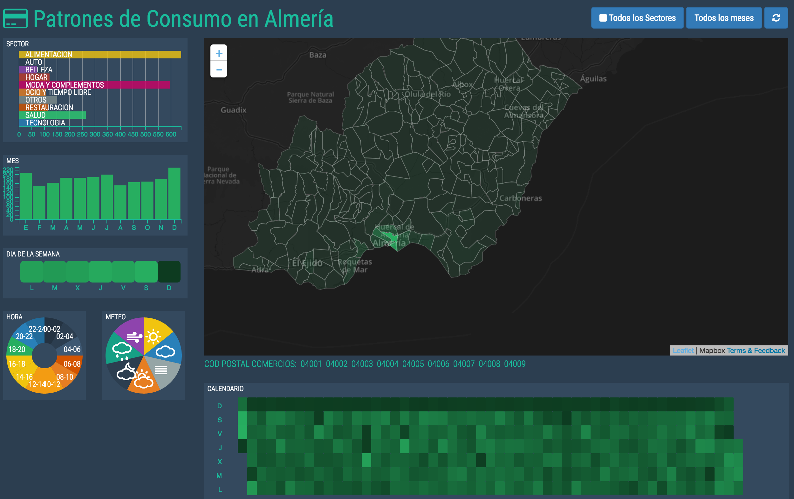

# ¿Qué es esto?
Proyecto realizado para el Hackathon organizado por Cajamar con motivo de la PyConEs 2016 en Almería, en Octubre de 2016.



Hemos desarrollado un dashboard interactivo para analizar los datos proporcionados por Cajamar, corresponientes a las transacciones con tarjeta de crédito realizadas en los comercios de Almería capital durante 2015.

Hemos enriquecido los datos proporcionados por la organización del hackathon con datos meteorológicos y sociodemográficos (ver más abajo)
 
El dashboard muestra gráficos enlazados en los que se visualiza el importe total de gasto en función de las distintas dimensiones presentes en el dataset. Además cada gráfico permite filtrar los datos para profundizar en el análisis de forma exploratoria.

# Demo Online
Se puede acceder al dashboard [AQUI](http://54.174.166.209:5001):




# El código
Se puede acceder al código fuente [AQUI](https://github.com/jabadia/cajamar)

## Estructura
* `client` : html, css, js... con `bower` y `grunt` (para compilar los ficheros `less` y pasar `jshint`)
* `server` : aplicación python/flask para servir el cliente y filtrar los datos: el servidor carga los datos al inicio en un dataframe de pandas y lo sirve en CSV cuando el cliente lo vaya pidiendo
* `data`   : directorio donde copiar los ficheros de datos (no incluidos)

## Notas de implementación

### Servidor

El servidor es una aplicación python/flask muy sencilla. Simplemente carga los datos en un dataframe de pandas al inicio y lo sirve cuando el cliente pide datos. Se usa `pandas` para filtrar datos por sector o por més y para muestrear el dataset extrayendo un número razonable de registros para devolver al cliente

### Cliente

La aplicación cliente es una SPA desarrollada en Angular.js usando principalmente la librería dc.js.

dc.js utiliza crossfilter.js y d3.js para crear gráficas enlazadas a partir de datasets multidimensionales

Además, incluimos un **mapa** usando la librería leaflet.js que carga los códigos postales en topoJson haciendo uso del plugin leaflet-omnivore

Finalmente hemos incluido un componente de **storytelling** que permite capturar y presentar distintos estados del dashboard de forma secuencial automáticamente

### Datos
Además de los datos proporcionados por la organización, aportamos varias fuentes de datos adicionales:

* **meteorología**, descargada offline usando la API de Dark Sky, nos da las condiciones meteorológicas de Almería para cada día de 2015.
* **códigos postales**, descargados del IGN / CartoCiudad en formato ESRI Shapefile y convertidos a topoJson para cargarlos en el mapa
* **datos sociodemográficos**, descargados de ...(Alicia)

## Instalación

```
$ git clone https://github.com/jabadia/cajamar
$ cd cajamar
```

### 1. instalar las dependencias del cliente

```
$ cd client
$ bower install
$ cd ..
```

### 2. instalar las dependencias del servidor

```
$ mkvirtualenv cajamar
$ cd server
$ pip install -r requirements
$ cd ..
```

### 3. copiar los datos en `data` 
```
$ cd data
$ (copiar los datos en cards.txt)
$ cd ..
```
(no están incluidos para no incumplir las condiciones de privacidad de datos del hackathon)
 
### 4. arrancar el servidor
```
$ cd server
$ python server.py
```


**Happy data day!**